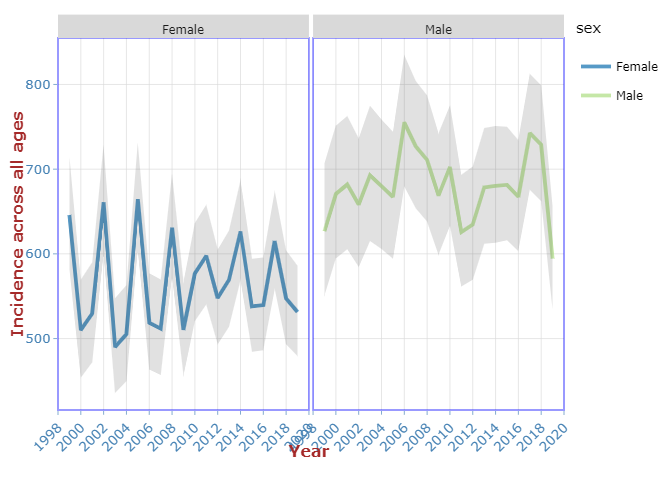
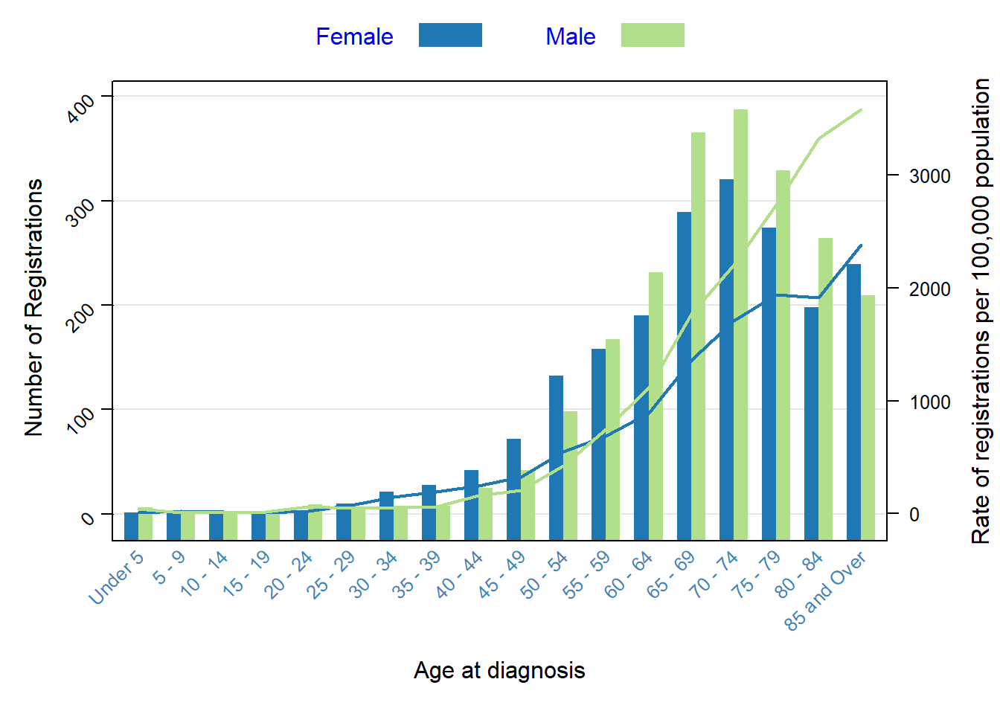
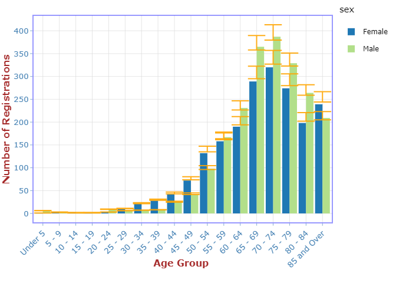
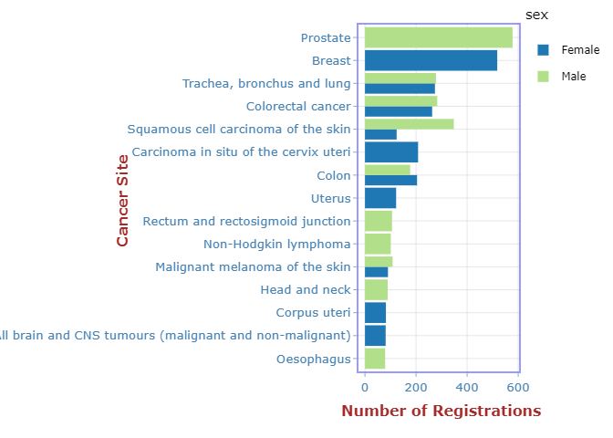
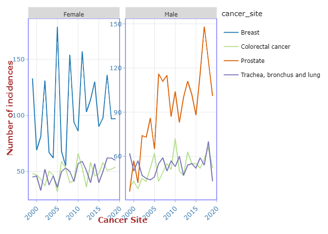

# Cancer Incidence : NHS Borders

## Domain knowledge and the business context

Public Health Scotland is Scotland's national health improvement agency and one of the country's main national public health bodies. We take a population focus, working to understand and influence what makes communities, regions, and countries more or less healthy. These factors that impact on health are known as the determinants of health.

In order to help inform the planning for provision of cancer treatment services in NHS Borders, we would like to gain better understanding of the incidence of cancer in NHS Borders.

**Tools Used:** R, Plotly

## Business Questions:

-   Cancer Incidence for all cancer types

-   Cancer Incidence with respect to age-specific rates (2015 - 2019)

-   Cancer Incidence using Standardized Incidence Ratio (SIR)

-   Cancer Incidence by Site

-   Cancer Incidence for the top 4 cancer sites across the Gender

-   Risk Factor with respect to Cancer Type

-   Cancer waiting times

**Data Source:**

Cancer incidence data - <https://www.opendata.nhs.scot/dataset/annual-cancer-incidence>

Geography health board labels lookup - <https://www.opendata.nhs.scot/dataset/9f942fdb-e59e-44f5-b534-d6e17229cc7b/resource/652ff726-e676-4a20-abda-435b98dd7bdc/download/geography_codes_and_labels_hb2014_01042019.csv>

Source: <https://www.opendata.nhs.scot/>

## **Key Findings:**

-   There have been significant changes in the rates of cancer over the past decade in NHS Borders.

-   The risk of developing cancer increased until 2017, after which it falls.

-   The rate, or risk, of cancer diagnoses increases with age in both sexes.

-   The rate of lung cancer is increased for women when compared to male. This also reflects the historical patterns of smoking in the population.

-   Colorectal cancer seems to increase with both sex.

## **Analysis:**

The Cancer Incidence Analysis report is available in the **analysis** folder *(both Rmd and HTML)*

Rmd : [Cancer Incidence - NHS Borders.Rmd](https://github.com/prathibapradeep/cancer_incidence_nhs_borders/blob/main/analysis/Cancer%20Incidence%20-%20NHS%20Borders.Rmd "Cancer Incidence - NHS Borders.Rmd")

HTML: [Cancer-Incidence---NHS-Borders.html](https://github.com/prathibapradeep/cancer_incidence_nhs_borders/blob/main/analysis/Cancer-Incidence---NHS-Borders.html "Cancer-Incidence---NHS-Borders.html")

Some plots demonstrating the insights

### **Cancer Incidence for all cancer types**:

Over the last ten years, the risk of developing cancer in Scotland NHS Borders seems to increase until 2017. There seems to be a decrease in trend from the year 2017 but the overall risk of cancer is higher in male than female

### **Cancer Incidence with respect to age-specific rates (2015 - 2019):**

The numbers of cancers increases with age to a peak at 70-74 years, and then declines thereafter as the size of the older population decreases. By statistics, in 2016, over 75% of cancer diagnoses were in people aged 60 and over.

The age specific numbers of cancers reflect both the risk and the number of people at risk.

### **Cancer Incidence using Standardized Incidence Ratio (SIR)**

A Standardized Incidence Ratio (SIR) is used in our case to determine if the occurrence of cancer in a relatively small population is high or low. A confidence interval is calculated around an SIR to determine how likely it is that the number of observed number of cases is high or low by chance.

### **Cancer Incidence by Site:**

### **Cancer Incidence for the top 4 cancer sites across the Gender:**

  

### **Cancer waiting times:**

Even though, the cancer is suspected or confirmed, it is not always the case that the treatment could begin as soon as possible. There could be various reasons for the waiting times. As per Public Health Scotland,a 62-day standard applies to GP referrals, cancer screening positive, self-referrals and a 31-day standard applies to all patients from the date a decision to treat a newly-diagnosed cancer is made.

-   All cancer screening programmes have the potential to identify cancers. So frequent Screening might help to diagnose cancer at an early stage

-   Existing diagnostic techniques can be enhanced which can help to diagnose the cancer at an early stage thus reducing the incidence rate for cancer. eg Incidental Cancer.

### **Assumptions:**

**Non-melanoma skin cancer:**

The first occurrence of a basal cell carcinoma is the most common type of non-melanoma skin cancer. This data is collected only in Scotland because they are so common. However other countries doesn't collect data on non-melanoma skin cancers.As per the Data and intelligence ( previously ISD Scotland),

References can be found in <https://www.isdscotland.org/Health-Topics/Cancer/Cancer-Statistics/Skin/>
