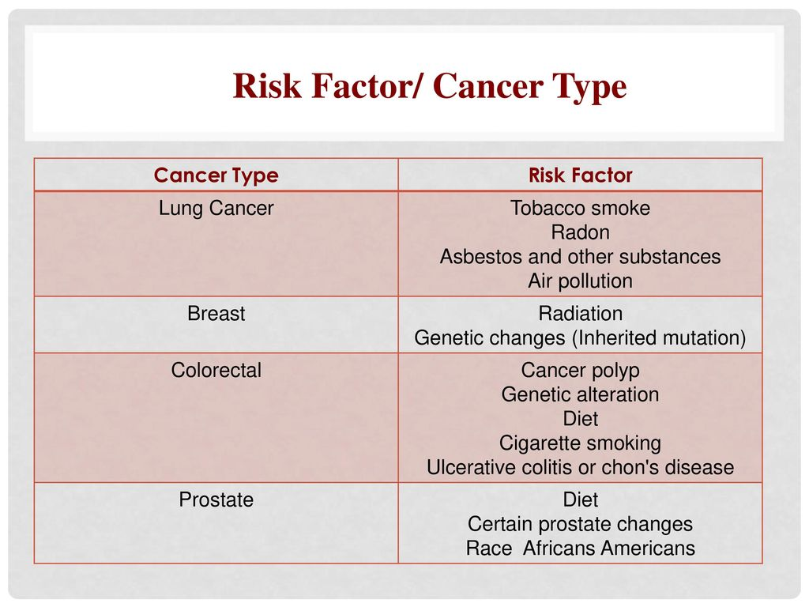

```{r setup, include=FALSE}
knitr::opts_chunk$set(
	echo = FALSE,
	message = FALSE,
	warning = FALSE
)
```

## 1. Introduction:

Predictions of cancer incidence can help to plan cancer services for the future. This report provides information on cancer incidence in NHS Borders of Scotland, covering the years from 1998 to 2019. Non-melanoma skin cancer is rarely fatal and often excluded from comparative analyses of cancer data. So in our analysis,the data on non-melanoma skin cancer is excluded. The cancer incidence data is collected from the open data and available in the [\<https://www.opendata.nhs.scot/\>](https://www.opendata.nhs.scot/){.uri}. 

```{r message=FALSE, warning=FALSE, include=FALSE}
library(here)
library(ggplot2)
library(plotly)
library(latticeExtra)
library(RColorBrewer)
```

```{r message=FALSE, warning=FALSE, include=FALSE}
source(here("cleaning_script/cancer_incidence_cleaning_script.R"))
```

```{r}
myColours <- brewer.pal(6,"Paired")

my.settings <- list(
  superpose.polygon=list(col=myColours[2:5], border="transparent"),
  strip.background=list(col=myColours[6]),
  strip.border=list(col="black")
)
```

## 2. Key Findings:

-   There have been significant changes in the rates of cancer over the past decade in NHS Borders.
-   The risk of developing cancer increased until 2017, after which it falls.
-   The rate, or risk, of cancer diagnoses increases with age in both sexes.
-   The rate of lung cancer is increased for women when compared to male. This also reflects the historical patterns of smoking in the population.
-   Colorectal cancer seems to increase with both sex.

## 3. Analysis on Cancer Incidence based on various factors

### 3.1 Cancer Incidence for all cancer types

```{r}
p <- cancer_incidence_borders %>% 
  filter(year > 1998,
         sex != "All",
         cancer_site == "All cancer types") %>% 
  ggplot()+
  aes(x = year, y = easr)+
  geom_line(aes(colour = sex), alpha = 0.75, size = 1) +
   geom_ribbon( aes(x=year, ymin= easr_lower_ci, ymax= easr_upper_ci),
                 alpha = 0.15, colour = NA)+
  scale_x_continuous( breaks = scales::breaks_extended(11))+
  facet_wrap(~sex)+
  color_theme()+
  labs(x = "\n Year ",
       y = "Incidence across all ages \n",
      ) +
 theme(axis.text.x = element_text(angle = 45, vjust = 0.5, hjust = 1)) +
 scale_colour_manual(values = c("#1f78b4", "#b2df8a"))
  
ggplotly(p)  
```

Over the last ten years, the risk of developing cancer in Scotland NHS Borders seems to increase until 2017. There seems to be a decrease in trend from the year 2017 but the overall risk of cancer is higher in male than female  

### 3.2 Cancer Incidence with respect to age-specific rates (2015 - 2019):

Below plot shows the cancer incidence for the year 2015 - 2019 with respect to the age-specific rate per 100,000 population.

```{r}
# --> construct separate plots for each series
cancer_data <- cancer_incidence_summary_borders %>% 
  filter(sex != "All",
         cancer_site == "All cancer types") 


plot1 <- barchart(num_of_incidences ~ age_category,
                 data = cancer_data,
                 groups = sex,
                 xlab = "Age at diagnosis", 
                 ylab = " Number of Registrations",
                 stack = FALSE,
                 scales = list(rot = 45, col = "steel blue"),
                 auto.key = list(columns = 2,space = "top", points=FALSE, rectangles=TRUE, col = "blue"),
                 par.settings = my.settings,
                 par.strip.text=list(col="white", font=2),
                 panel=function(x,y,...){
                       panel.grid(h=-1, v=0); 
                       panel.barchart(x,y,...)
                 }
                )

plot2 <- xyplot(rate_of_incidences ~ age_category, 
               data = cancer_data,
               groups = sex,
               type = "a",
               lwd = 2,
               ylab = "Rate of registrations per 100,000 population",
               par.settings = list(
                 superpose.line = list(col = c("#1f78b4", "#b2df8a")))
               )
 
doubleYScale(plot1, 
             plot2,
             use.style = FALSE,
             add.ylab2 = TRUE)

```

The numbers of cancers increases with age to a peak at 70-74 years, and then declines thereafter as the size of the older population decreases. By statistics, in 2016, over 75% of cancer diagnoses were in people aged 60 and over.

The age specific numbers of cancers reflect both the risk and the number of people at risk.

### 3.3 Cancer Incidence using Standardized Incidence Ratio (SIR)

```{r}

p <- cancer_incidence_summary_borders %>% 
  filter(sex != "All",
         cancer_site == "All cancer types") %>% 
  select(age_category,num_of_incidences,standardised_incidence_ratio ,sex,cancer_site,
         sir_lower95pc_confidence_interval, sir_upper95pc_confidence_interval) %>%
    mutate (lower_ci = num_of_incidences *100 /sir_lower95pc_confidence_interval,
             upper_ci = num_of_incidences *100 /sir_upper95pc_confidence_interval) %>% 
  distinct() %>% 
  ggplot()+
  aes(x = age_category, y = num_of_incidences)+
  geom_col(aes(fill = sex),position = "dodge")+
  geom_errorbar( aes(x=age_category, ymin= lower_ci, ymax= upper_ci),
                 position = "dodge",
                 width=0.6,
                 colour="orange",
                 alpha=0.9,
                 size=1)+
  color_theme()+
  labs(x = "Age Group ",
       y = "Number of Registrations",
      ) +
  scale_y_continuous( breaks = scales::breaks_extended(10))+
  theme(axis.text.x = element_text(angle = 45, vjust = 0.5, hjust = 1)) +
  scale_fill_manual(values = c("#1f78b4", "#b2df8a"))


ggplotly(p)

```

A Standardized Incidence Ratio (SIR) is used in our case to determine if the occurrence of cancer in a relatively small population is high or low. A confidence interval is calculated around an SIR to determine how likely it is that the number of observed number of cases is high or low by chance.

### 3.4 Cancer Incidence by Site:

```{r}

p <- cancer_incidence_summary_borders %>% 
     mutate (lower_ci = incidences_all_ages *100 /sir_lower95pc_confidence_interval,
             upper_ci = incidences_all_ages *100 /sir_upper95pc_confidence_interval) %>% 
  filter (cancer_site != "All cancer types",
          sex != "All") %>% 
  select (cancer_site, incidences_all_ages, sex,lower_ci, upper_ci) %>% 
  distinct() %>% 
  arrange(desc(incidences_all_ages)) %>% 
  slice_max(incidences_all_ages,n = 20) %>% 
  ggplot()+
  aes(x= reorder(cancer_site,incidences_all_ages), y = incidences_all_ages, fill = sex ) +
  geom_col(position = "dodge") +
  coord_flip() +
  color_theme() +
  labs(y = "Number of Registrations\n",
       x = "\nCancer Site",
      ) +
 scale_fill_manual(values = c("#1f78b4", "#b2df8a"))

ggplotly(p)
```

Though the plot shows that the highest cases has been seen in men for Prostate Cancer and female for Breast Cancer, Lung cancer remains the most common cancer in NHS Borders for both sexes combined, for the period of 2015 - 2019.

### 3.5 Cancer Incidence for the top 4 cancer sites across the Gender:

```{r}
p <- cancer_incidence_borders %>% 
   filter ((cancer_site %in% c("Breast","Colorectal cancer","Trachea, bronchus and lung") & sex == "Female") |
            (cancer_site %in% c("Prostate","Colorectal cancer", "Trachea, bronchus and lung") & sex == "Male"),
           year > 1998) %>%
  select (year, cancer_site,incidences_all_ages, sex) %>%
  distinct() %>% 
  ggplot()+
  aes(x= year, y = incidences_all_ages) +
  geom_line(aes(colour = cancer_site)) +
  facet_wrap(~sex, scales = "free" )+
  color_theme() +
  labs(y = "\n Number of incidences\n",
       x = "\n Cancer Site",
      ) +
  theme(axis.text.x = element_text(angle = 45, vjust = 0.5, hjust = 1)) +
  scale_colour_manual(values = c("#1f78b4", "#b2df8a", "#d95f02","#7570b3"))

ggplotly(p)
  
```

For females, there has been little significant change in rates in Breast Cancer and colorectal cancer, but increase rates in Lung Cancer. For males, there has been a great rise in prostate cancers and a little significant rise in the colorectal cancer but the cancer rate falls in lung cancers

## 4. Risk Factor with respect to Cancer Type:

The trends in cancer incidence may also be influenced by changes in the prevalence of risk factors associated with cancer over time.

{width="414"}

## 4.1 Cancer waiting times:

Even though, the cancer is suspected or confirmed, it is not always the case that the treatment could begin as soon as possible. There could be various reasons for the waiting times. As per Public Health Scotland,a 62-day standard applies to GP referrals, cancer screening positive, self-referrals and a 31-day standard applies to all patients from the date a decision to treat a newly-diagnosed cancer is made.

-   All cancer screening programmes have the potential to identify cancers. So frequent Screening might help to diagnose cancer at an early stage
-   Existing diagnostic techniques can be enhanced which can help to diagnose the cancer at an early stage thus reducing the incidence rate for cancer. eg Incidental Cancer.

## 5. Assumptions:

**Non-melanoma skin cancer:**

The first occurrence of a basal cell carcinoma is the most common type of non-melanoma skin cancer. This data is collected only in Scotland because they are so common. However other countries doesn't collect data on non-melanoma skin cancers.As per the Data and intelligence ( previously ISD Scotland),

References can be found in [\<https://www.isdscotland.org/Health-Topics/Cancer/Cancer-Statistics/Skin/\>](https://www.isdscotland.org/Health-Topics/Cancer/Cancer-Statistics/Skin/){.uri}

## 6. Data Source:

Cancer incidence data - <https://www.opendata.nhs.scot/dataset/annual-cancer-incidence>

Geography health board labels lookup - <https://www.opendata.nhs.scot/dataset/9f942fdb-e59e-44f5-b534-d6e17229cc7b/resource/652ff726-e676-4a20-abda-435b98dd7bdc/download/geography_codes_and_labels_hb2014_01042019.csv>

Source: <https://www.opendata.nhs.scot/>
